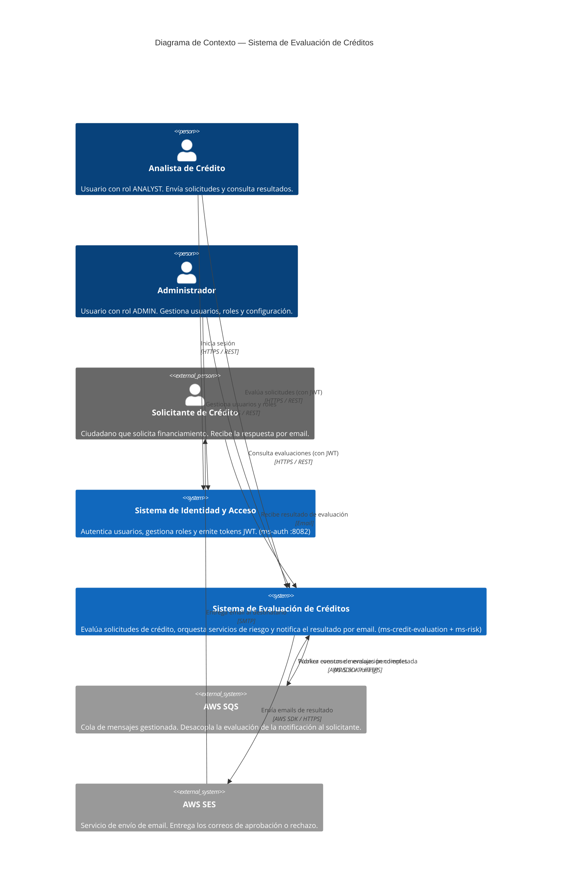

# C4 — Nivel 1: Diagrama de Contexto del Sistema

## Descripción

El diagrama de contexto muestra el sistema de evaluación de créditos como una caja negra, sus usuarios directos y los sistemas externos con los que interactúa.

---

## Diagrama C4 Context (Mermaid)



---

## Diagrama ASCII (referencia rápida)

```
┌──────────────────────────────────────────────────────────────────────┐
│                  SISTEMA DE EVALUACIÓN DE CRÉDITOS                    │
│                       [C4 — Level 1: Context]                         │
└──────────────────────────────────────────────────────────────────────┘

 ┌──────────────┐   HTTPS/REST (login)   ┌──────────────────────────┐
 │   Analista   │ ──────────────────────>│  SISTEMA DE IDENTIDAD    │
 │  de Crédito  │ <── JWT ──────────────│  Y ACCESO                │
 └──────┬───────┘                        │  (ms-auth — Auth)           │
        │                                │                          │
 ┌──────┴───────┐   HTTPS/REST (login)   │  • Login / JWT           │
 │Administrador │ ──────────────────────>│  • Gestión de usuarios   │
 │              │ <── JWT ──────────────│  • Roles: ADMIN,         │
 └──────┬───────┘                        │    ANALYST, VIEWER       │
        │                                └──────────────────────────┘
        │ HTTPS/REST + JWT Bearer
        ▼
 ┌──────────────────────────────────────┐
 │  SISTEMA DE EVALUACIÓN DE CRÉDITOS   │
 │  (ms-credit-evaluation — Orquestador + Frontend)     │
 │                                      │
 │  • Evalúa solicitudes de crédito     │
 │  • Consulta score y deudas (ms-risk)    │
 │  • Persiste evaluaciones (creditos_db│
 │  • Notifica resultado (SQS + SES)    │
 └──────────────┬───────────────────────┘
                │ AWS SDK (publish)               ┌──────────────┐
                ▼                                 │  Solicitante │
 ┌──────────────────────┐                         │  de Crédito  │
 │      AWS SQS         │                         └──────┬───────┘
 │  (cola de eventos)   │                                ▲
 └──────────┬───────────┘                                │ Email
            │ polling                                     │
            ▼                                            │
 ┌──────────────────────┐                               │
 │      AWS SES         │ ──────────────────────────────┘
 │  (envío de email)    │
 └──────────────────────┘
```

---

## Actores y Sistemas — Tabla Resumen

| Elemento | Tipo | Descripción | Tecnología |
|----------|------|-------------|-----------|
| Analista de Crédito | Persona | Opera el frontend para evaluar solicitudes | Navegador web |
| Administrador | Persona | Gestiona usuarios y roles vía ms-auth | Navegador web |
| Solicitante de Crédito | Persona (externo) | No interactúa directamente; recibe el resultado por email | Email |
| Sistema de Identidad y Acceso | **Sistema propio (ms-auth)** | Autenticación, autorización, gestión de usuarios y roles | Quarkus + PostgreSQL (auth_db) |
| Sistema de Evaluación de Créditos | **Sistema propio (ms-credit-evaluation + ms-risk)** | Orquestación de evaluaciones, riesgos y notificaciones | React + Quarkus + PostgreSQL (creditos_db) |
| AWS SQS | Sistema externo | Cola de mensajes para desacoplar evaluación y notificación | AWS Managed Service |
| AWS SES | Sistema externo | Servicio de email transaccional | AWS Managed Service |

---

## Notas de Diseño del Contexto

### ¿Por qué el Solicitante no interactúa directamente con el sistema?
El solicitante es quien se beneficia del resultado pero no opera el sistema directamente: en el modelo de negocio actual, el analista ingresa los datos en nombre del solicitante. El solicitante solo recibe la notificación por email con el veredicto.

### ¿Por qué Auth es un sistema separado?
El Sistema de Identidad y Acceso (ms-auth) está desacoplado del Sistema de Evaluación de Créditos porque:
1. **Responsabilidad única**: ms-credit-evaluation no mezcla lógica de negocio (evaluar créditos) con lógica de identidad (gestionar usuarios).
2. **Escalabilidad independiente**: ms-auth puede evolucionar sin afectar a ms-credit-evaluation.
3. **Reutilización**: ms-auth podría emitir tokens para otros servicios futuros sin modificar ms-credit-evaluation.
4. El acoplamiento en runtime es **cero**: ms-credit-evaluation valida JWTs solo con la clave pública RSA, sin hacer llamadas HTTP a ms-auth.

### ¿Por qué AWS SQS y no llamada directa a email?
El desacoplamiento asíncrono via SQS garantiza:
1. **Resiliencia**: si SES falla, el mensaje persiste en la cola y se reintenta.
2. **Rendimiento**: el endpoint de evaluación responde en < 5s sin esperar el envío del email.
3. **Observabilidad**: SQS permite monitorear mensajes pendientes y fallidos (DLQ).

### Límites del sistema
El sistema **no** incluye:
- Consulta a burós de crédito reales (se usa mock)
- Portal de autoservicio para el solicitante
- Integración con core bancario
- SSO / federación con proveedores externos (ms-auth usa usuarios internos)
