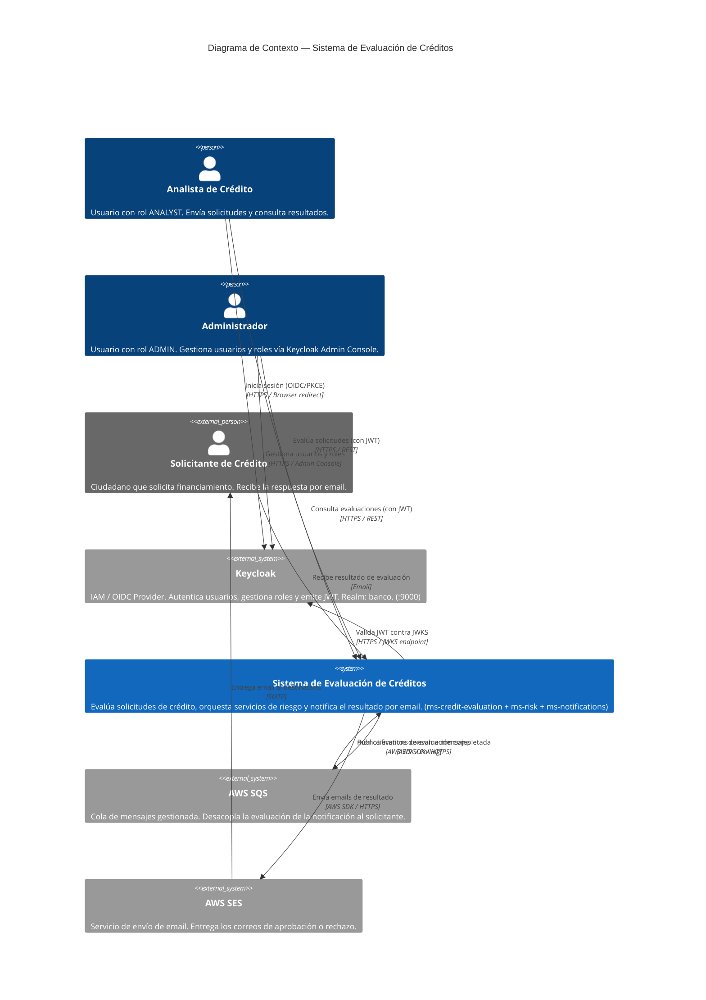

# C4 — Nivel 1: Diagrama de Contexto del Sistema

## Descripción

El diagrama de contexto muestra el sistema de evaluación de créditos como una caja negra, sus usuarios directos y los sistemas externos con los que interactúa.

---

## Diagrama C4 Context (Mermaid)



---

## Diagrama ASCII (referencia rápida)

```
┌──────────────────────────────────────────────────────────────────────┐
│                  SISTEMA DE EVALUACIÓN DE CRÉDITOS                    │
│                       [C4 — Level 1: Context]                         │
└──────────────────────────────────────────────────────────────────────┘

 ┌──────────────┐  OIDC/PKCE (login)   ┌──────────────────────────────┐
 │   Analista   │ ────────────────────>│  KEYCLOAK  :9000             │
 │  de Crédito  │ <── JWT ────────────│  Realm: banco                │
 └──────┬───────┘                      │                              │
        │                              │  • Authorization Code + PKCE │
 ┌──────┴───────┐  Admin Console       │  • Gestión de usuarios       │
 │Administrador │ ────────────────────>│  • Roles: ADMIN, ANALYST,    │
 │              │                      │    VIEWER                    │
 └──────┬───────┘                      │  • JWKS endpoint             │
        │                              └──────────────────────────────┘
        │ HTTPS/REST + JWT Bearer             │ JWKS validation
        ▼                                     ▼
 ┌──────────────────────────────────────────────────────┐
 │         SISTEMA DE EVALUACIÓN DE CRÉDITOS            │
 │  (Frontend React + ms-credit-evaluation + ms-risk    │
 │   + ms-notifications)                                │
 │                                                      │
 │  • Evalúa solicitudes de crédito                     │
 │  • Consulta score y deudas (ms-risk)                 │
 │  • Persiste evaluaciones (creditos_db)               │
 │  • Notifica resultado (SQS + SES via ms-notifications│
 └──────────────────────┬───────────────────────────────┘
                        │ AWS SDK (publish)          ┌──────────────┐
                        ▼                            │  Solicitante │
 ┌──────────────────────┐                            │  de Crédito  │
 │      AWS SQS         │                            └──────┬───────┘
 │  (cola de eventos)   │                                   ▲
 └──────────┬───────────┘                                   │ Email
            │ polling                                        │
            ▼                                               │
 ┌──────────────────────┐                                  │
 │      AWS SES         │ ─────────────────────────────────┘
 │  (envío de email)    │
 └──────────────────────┘
```

---

## Actores y Sistemas — Tabla Resumen

| Elemento | Tipo | Descripción | Tecnología |
|----------|------|-------------|-----------|
| Analista de Crédito | Persona | Opera el frontend para evaluar solicitudes | Navegador web |
| Administrador | Persona | Gestiona usuarios y roles vía Keycloak Admin Console | Navegador web |
| Solicitante de Crédito | Persona (externo) | No interactúa directamente; recibe el resultado por email | Email |
| Keycloak | **Sistema externo (IAM)** | OIDC Provider: autenticación, autorización, emisión de JWT, gestión de usuarios y roles | Keycloak 24.x + PostgreSQL (keycloak_db) |
| Sistema de Evaluación de Créditos | **Sistema propio** | Orquestación de evaluaciones, riesgos y notificaciones | React + Quarkus + PostgreSQL (creditos_db + notifications_db) |
| AWS SQS | Sistema externo | Cola de mensajes para desacoplar evaluación y notificación | AWS Managed Service |
| AWS SES | Sistema externo | Servicio de email transaccional | AWS Managed Service |

---

## Notas de Diseño del Contexto

### ¿Por qué el Solicitante no interactúa directamente con el sistema?
El solicitante es quien se beneficia del resultado pero no opera el sistema directamente: en el modelo de negocio actual, el analista ingresa los datos en nombre del solicitante. El solicitante solo recibe la notificación por email con el veredicto.

### ¿Por qué Keycloak es un sistema externo y no propio?
Keycloak es un producto de IAM dedicado, no un microservicio desarrollado por el equipo. Se clasifica como sistema externo porque:
1. **No se desarrolla ni se mantiene código propio** de autenticación — Keycloak gestiona todo internamente.
2. **Es un proveedor de identidad estándar** (OIDC/OAuth2): ms-credit-evaluation solo consume su JWKS endpoint para validar tokens.
3. **Acoplamiento mínimo**: si se reemplaza Keycloak por otro IdP (Auth0, AWS Cognito), solo cambia la URL del JWKS en `application.properties` — el código de negocio no se toca.
4. **Admin Console propia**: la gestión de usuarios y roles ocurre en la UI de Keycloak, no en el sistema de créditos.

### ¿Por qué AWS SQS y no llamada directa a email?
El desacoplamiento asíncrono via SQS garantiza:
1. **Resiliencia**: si SES falla, el mensaje persiste en la cola y se reintenta.
2. **Rendimiento**: el endpoint de evaluación responde en < 5s sin esperar el envío del email.
3. **Observabilidad**: SQS permite monitorear mensajes pendientes y fallidos (DLQ).

### Límites del sistema
El sistema **no** incluye:
- Consulta a burós de crédito reales (se usa mock)
- Portal de autoservicio para el solicitante
- Integración con core bancario
- SSO / federación con proveedores externos (Keycloak puede añadir federación LDAP/AD en el futuro sin cambiar el sistema de créditos)
