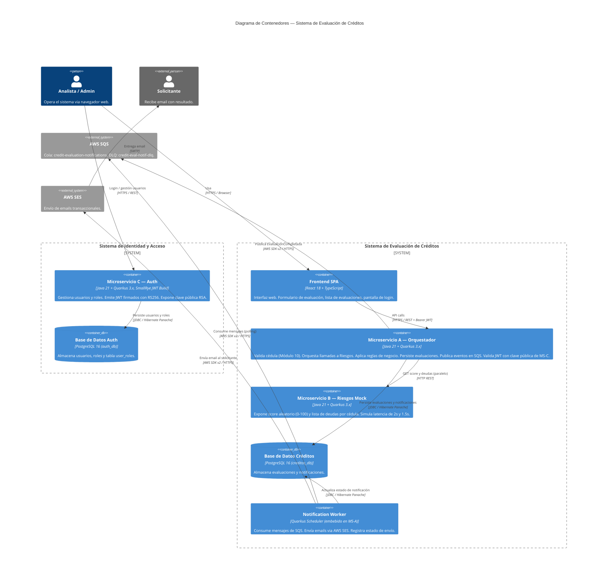

# C4 — Nivel 2: Diagrama de Contenedores

## Descripción

Descompone el sistema en sus contenedores de ejecución: aplicaciones, bases de datos, colas y workers, mostrando cómo se comunican entre sí.

---

## Diagrama C4 Contenedores (Mermaid)



---

## Diagrama ASCII — Vista de Contenedores

```
 ┌──────────────────────────────────────────────────────────────────────────┐
 │              SISTEMA DE IDENTIDAD Y ACCESO (MS-C)                        │
 │                                                                          │
 │  ┌────────────────────────────────────────────────────────────────────┐  │
 │  │  Microservicio C — Auth          :8082                             │  │
 │  │  • POST /v1/auth/login                                             │  │
 │  │  • POST /v1/auth/users           (solo ADMIN)                      │  │
 │  │  • GET  /v1/auth/users           (solo ADMIN)                      │  │
 │  │  • GET  /v1/auth/users/{id}      (solo ADMIN)                      │  │
 │  │  • PUT  /v1/auth/users/{id}/roles(solo ADMIN)                      │  │
 │  │  • GET  /v1/auth/public-key      (público — PEM de clave pública)  │  │
 │  └───────────────────────────┬────────────────────────────────────────┘  │
 │                              │ JDBC                                      │
 │  ┌───────────────────────────▼────────────────────────────────────────┐  │
 │  │  PostgreSQL 16 — auth_db                                           │  │
 │  │  • users  • roles  • user_roles                                    │  │
 │  └────────────────────────────────────────────────────────────────────┘  │
 └──────────────────────────────────────────────────────────────────────────┘
                     │ JWT (Bearer token)
                     ▼
 ┌──────────────────────────────────────────────────────────────────────────┐
 │              SISTEMA DE EVALUACIÓN DE CRÉDITOS                           │
 │                                                                          │
 │  ┌────────────────┐    HTTPS/REST+JWT  ┌──────────────────────────────┐  │
 │  │  Frontend SPA  │ ────────────────>  │  Microservicio A             │  │
 │  │  React 18      │ <────────────────  │  Orquestador   :8080         │  │
 │  │  :3000         │                   │                              │  │
 │  └────────────────┘                   │  • POST /v1/credit-evaluations│  │
 │                                       │  • GET  /v1/credit-evaluations│  │
 │                                       │  • GET  /v1/credit-evaluations│  │
 │                                       │         /{id}                │  │
 │                                       │  [valida JWT con clave        │  │
 │                                       │   pública de MS-C]           │  │
 │                                       └──────┬────────────┬──────────┘  │
 │                                              │            │              │
 │                          HTTP REST (paralelo)│            │ JDBC         │
 │                                              ▼            ▼              │
 │  ┌────────────────────────────┐   ┌─────────────────────────────────┐   │
 │  │  Microservicio B           │   │  PostgreSQL 16 — creditos_db    │   │
 │  │  Riesgos Mock  :8081       │   │                                 │   │
 │  │  • GET /v1/risk/score/{c}  │   │  • credit_evaluations           │   │
 │  │  • GET /v1/risk/debts/{c}  │   │  • notifications                │   │
 │  └────────────────────────────┘   └──────────────────┬──────────────┘   │
 │                                                       ▲                  │
 │                                                       │ JDBC             │
 │                                        ┌──────────────┴──────────┐       │
 │                                        │  Notification Worker    │       │
 │                                        │  (Quarkus Scheduler)    │       │
 │                                        └──────────┬──────────────┘       │
 └─────────────────────────────────────────────────── ┼─────────────────────┘
                                                       │ AWS SDK
                            ┌──────────────────────────┼──────────────────┐
                            │            AWS            │                  │
                            │                           ▼                  │
                            │               ┌───────────────────┐          │
                            │               │     AWS SQS       │          │
                            │               └───────────────────┘          │
                            │               ┌───────────────────┐          │
                            │               │     AWS SES       │          │
                            │               └───────────────────┘          │
                            └──────────────────────────────────────────────┘
```

---

## Contenedores — Tabla Detallada

| Contenedor | Tecnología | Puerto | Responsabilidad Principal |
|------------|-----------|--------|--------------------------|
| Frontend SPA | React 18, TypeScript, Axios | 3000 | UI de evaluación, login, listado |
| Microservicio A — Orquestador | Java 21, Quarkus 3.x, Hibernate Panache | 8080 | API de evaluaciones, validación, reglas de negocio, notificaciones |
| Microservicio B — Riesgos Mock | Java 21, Quarkus 3.x | 8081 | Score y deudas aleatorios por cédula |
| Microservicio C — Auth | Java 21, Quarkus 3.x, SmallRye JWT Build | 8082 | Login, emisión JWT, gestión de usuarios y roles |
| Base de Datos Créditos (`creditos_db`) | PostgreSQL 16 | 5432 | Evaluaciones y notificaciones (MS-A) |
| Base de Datos Auth (`auth_db`) | PostgreSQL 16 | 5433 | Usuarios y roles (MS-C) |
| Notification Worker | Quarkus Scheduler (embebido en MS-A) | — | Polling SQS + envío email |
| AWS SQS | AWS Managed | — | Desacoplamiento async de notificaciones |
| AWS SES | AWS Managed | — | Envío de emails transaccionales |

---

## Protocolos de Comunicación — Justificación

### Frontend ↔ Microservicio C (login)
- El frontend llama a MS-C para autenticarse y recibir un JWT
- Una vez obtenido el token, el frontend no vuelve a llamar a MS-C durante la sesión

### Frontend ↔ Microservicio A: REST + JSON sobre HTTPS
- Simplicidad de consumo desde el navegador
- JSON nativo en JavaScript/TypeScript
- Autenticación Bearer JWT en header `Authorization`

### Microservicio A ↔ Microservicio C: sin llamadas en runtime
- MS-A valida los JWT usando la **clave pública RSA** de MS-C
- La clave pública se distribuye como archivo PEM en el build (o vía `GET /v1/auth/public-key` en startup)
- No existe acoplamiento en runtime: si MS-C cae, MS-A sigue validando tokens ya emitidos
- Ver [ADR-008](./09-adr.md#adr-008-desacoplamiento-de-identidad-en-microservicio-independiente)

### Microservicio A ↔ Microservicio B: REST sobre HTTP (interna)
- Las llamadas son **síncronas y paralelas** usando MicroProfile REST Client con `@RegisterRestClient`
- Se lanzan en paralelo (`CompletableFuture` / `Uni.zip`) para reducir latencia total:
  - Sin paralelismo: 2s (score) + 1.5s (deudas) = 3.5s
  - Con paralelismo: max(2s, 1.5s) = **2s** (ahorro del 43%)
- Se configuran timeouts de 5s y Circuit Breaker vía SmallRye Fault Tolerance

> **¿Por qué no gRPC aquí?** Ver [ADR-002](./09-adr.md#adr-002-rest-vs-grpc-para-comunicacion-a-b)

### Microservicio A → AWS SQS: AWS SDK v2
- Publicación asíncrona fire-and-forget post-evaluación
- No bloquea el tiempo de respuesta al cliente
- Retry automático con backoff incluido en el SDK

### Notification Worker → AWS SQS: Long Polling
- Pull de hasta 10 mensajes cada 20 segundos (`WaitTimeSeconds=20`)
- Visibility timeout de 60s para procesamiento seguro
- Delete message solo al confirmar envío exitoso (at-least-once)

---

## Despliegue con Docker Compose (desarrollo local)

```yaml
# Servicios que se ejecutan localmente
services:
  frontend:         # React :3000
  orchestrator:     # Quarkus MS-A :8080
  risk-service:     # Quarkus MS-B :8081
  auth-service:     # Quarkus MS-C :8082
  postgres-credits: # PostgreSQL :5432 — creditos_db
  postgres-auth:    # PostgreSQL :5433 — auth_db
  localstack:       # Emulación local de SQS y SES (LocalStack)
```

> En producción, SQS y SES son servicios AWS reales. LocalStack permite desarrollo offline.
> Los dos contenedores PostgreSQL pueden combinarse en uno solo con dos bases de datos distintas si se prefiere simplificar el entorno local.
