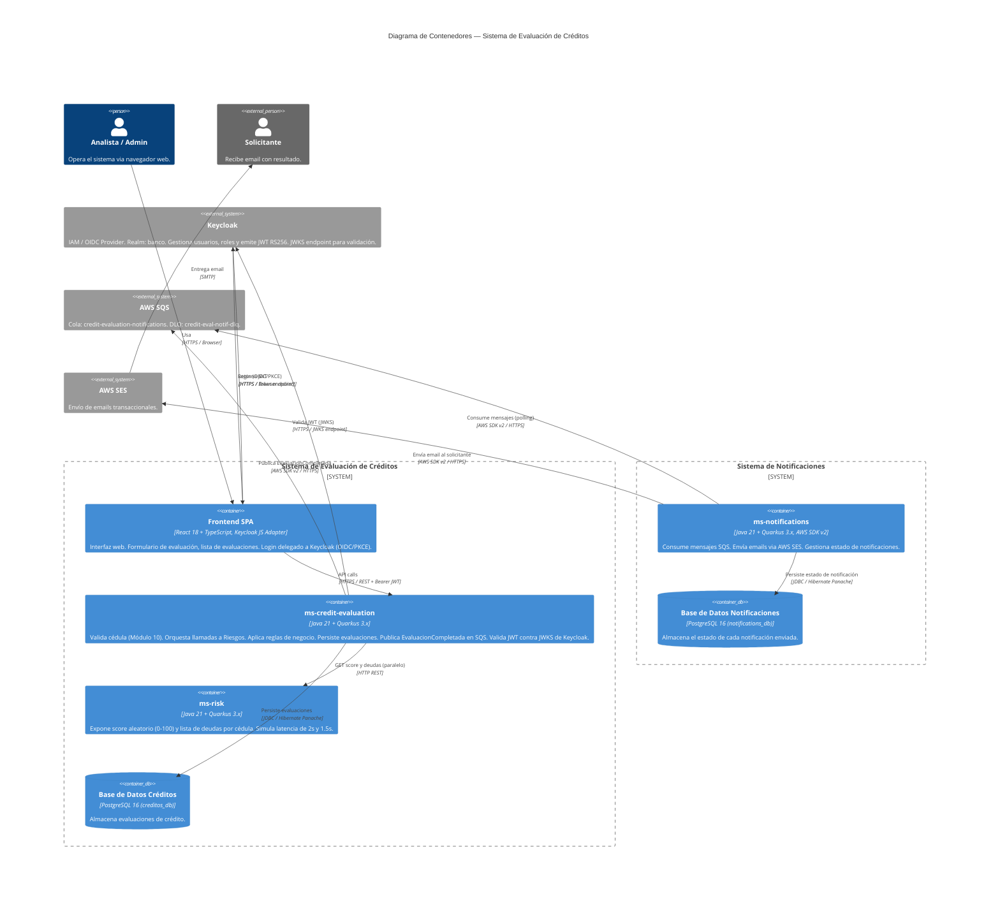

# C4 — Nivel 2: Diagrama de Contenedores

## Descripción

Descompone el sistema en sus contenedores de ejecución: aplicaciones, bases de datos, colas y workers, mostrando cómo se comunican entre sí.

---

## Diagrama C4 Contenedores (Mermaid)



---

## Diagrama ASCII — Vista de Contenedores

```
 ┌──────────────────────────────────────────────────────────────┐
 │              KEYCLOAK  :9000  (IAM / OIDC Provider)          │
 │  Realm: banco                                                │
 │  • Authorization Code + PKCE (login desde Frontend)         │
 │  • Token endpoint  — emite JWT RS256                         │
 │  • JWKS endpoint   — clave pública para validación           │
 │  • Admin Console   — gestión de usuarios y roles             │
 │  • Roles: ADMIN, ANALYST, VIEWER                             │
 └──────────────┬───────────────────────────────┬──────────────┘
    OIDC/PKCE   │ JWT                     JWKS   │ (validación)
                ▼                               │
 ┌──────────────────────────────────────────────┼──────────────┐
 │              SISTEMA DE EVALUACIÓN DE CRÉDITOS               │
 │  ┌─────────────┐  REST+JWT  ┌────────────────┴────────────┐  │
 │  │ Frontend    │ ─────────> │  ms-credit-evaluation :8080  │  │
 │  │ React :3000 │ <───────── │  • POST /v1/credit-eval...   │  │
 │  │ keycloak-js │            │  • GET  /v1/credit-eval...   │  │
 │  └─────────────┘            │  [valida JWT via JWKS de     │  │
 │                             │   Keycloak]                  │  │
 │                             └──────────┬──────────┬────────┘  │
 │                    HTTP REST (paralelo)│          │ JDBC       │
 │                                        ▼          ▼            │
 │  ┌──────────────────────┐  ┌─────────────────────────────┐    │
 │  │  ms-risk  :8081      │  │  PostgreSQL — creditos_db   │    │
 │  │  • GET score/{c}     │  │  • credit_evaluations       │    │
 │  │  • GET debts/{c}     │  └─────────────────────────────┘    │
 │  └──────────────────────┘                                      │
 └────────────────────────────────┬─────────────────────────────-┘
                                  │ AWS SDK (publish)
                                  ▼
                           ┌─────────────┐
                           │   AWS SQS   │
                           └──────┬──────┘
                                  │ polling
                                  ▼
 ┌──────────────────────────────────────────────────────────────┐
 │                SISTEMA DE NOTIFICACIONES (ms-notifications)  │
 │  ┌──────────────────────────────────────────────────────┐    │
 │  │  ms-notifications  :8083                             │    │
 │  │  • Quarkus Scheduler — consume SQS cada 20s          │    │
 │  │  • Envía emails via AWS SES                          │    │
 │  │  • Idempotencia por evaluacionId                     │    │
 │  └───────────────────────┬──────────────────────────────┘    │
 │                          │ JDBC             │ AWS SDK         │
 │                          ▼                  ▼                 │
 │  ┌──────────────────────────────┐    ┌─────────────┐         │
 │  │  PostgreSQL — notifications_db│    │   AWS SES   │         │
 │  │  • notifications             │    └─────────────┘         │
 │  └──────────────────────────────┘                            │
 └──────────────────────────────────────────────────────────────┘
```

---

## Contenedores — Tabla Detallada

| Contenedor | Tecnología | Puerto | Responsabilidad Principal |
|------------|-----------|--------|--------------------------|
| Keycloak | Keycloak 24.x, PostgreSQL (keycloak_db) | 9000 | IAM / OIDC: login, emisión JWT, gestión de usuarios y roles |
| Frontend SPA | React 18, TypeScript, Keycloak JS Adapter | 3000 | UI de evaluación, login delegado a Keycloak, listado |
| ms-credit-evaluation | Java 21, Quarkus 3.x, Hibernate Panache | 8080 | API de evaluaciones, validación, reglas de negocio, publicación SQS, validación JWT via JWKS |
| ms-risk | Java 21, Quarkus 3.x | 8081 | Score y deudas aleatorios por cédula |
| ms-notifications | Java 21, Quarkus 3.x, AWS SDK v2 | 8083 | Consumo SQS, envío email SES, estado de notificaciones |
| Base de Datos Créditos (`creditos_db`) | PostgreSQL 16 | 5432 | Evaluaciones de crédito (ms-credit-evaluation) |
| Base de Datos Notificaciones (`notifications_db`) | PostgreSQL 16 | 5434 | Estado de notificaciones (ms-notifications) |
| Base de Datos Keycloak (`keycloak_db`) | PostgreSQL 16 | 5435 | Usuarios, credenciales, roles (gestionada por Keycloak) |
| AWS SQS | AWS Managed | — | Desacoplamiento async entre ms-credit-evaluation y ms-notifications |
| AWS SES | AWS Managed | — | Envío de emails transaccionales |

---

## Protocolos de Comunicación — Justificación

### Frontend ↔ Keycloak (login — OIDC/PKCE)
- El frontend inicia el flujo OIDC Authorization Code + PKCE redirigiendo al login de Keycloak
- Keycloak autentica al usuario y retorna un `authorization_code` via redirect
- El frontend intercambia el code por `access_token` + `refresh_token` en el token endpoint
- El `access_token` (JWT) se usa en todos los requests siguientes a ms-credit-evaluation
- `keycloak-js` gestiona el ciclo de vida del token (renovación automática con refresh token)

### Frontend ↔ ms-credit-evaluation: REST + JSON sobre HTTPS
- Simplicidad de consumo desde el navegador
- JSON nativo en JavaScript/TypeScript
- Autenticación Bearer JWT en header `Authorization`

### ms-credit-evaluation ↔ Keycloak: validación JWT via JWKS
- ms-credit-evaluation valida los JWT contra el **JWKS endpoint de Keycloak**
- `mp.jwt.verify.publickey.location=http://keycloak:9000/realms/banco/protocol/openid-connect/certs`
- Quarkus SmallRye JWT cachea las claves públicas — no hay llamada JWKS por cada request
- Si Keycloak cae, ms-credit-evaluation sigue validando tokens con las claves cacheadas
- Ver [ADR-010](./09-adr.md#adr-010-adopción-de-keycloak-como-iam)

### ms-credit-evaluation ↔ ms-risk: REST sobre HTTP (interna)
- Las llamadas son **síncronas y paralelas** usando MicroProfile REST Client con `@RegisterRestClient`
- Se lanzan en paralelo (`CompletableFuture` / `Uni.zip`) para reducir latencia total:
  - Sin paralelismo: 2s (score) + 1.5s (deudas) = 3.5s
  - Con paralelismo: max(2s, 1.5s) = **2s** (ahorro del 43%)
- Se configuran timeouts de 5s y Circuit Breaker vía SmallRye Fault Tolerance

> **¿Por qué no gRPC aquí?** Ver [ADR-002](./09-adr.md#adr-002-rest-vs-grpc-para-comunicacion-a-b)

### ms-credit-evaluation → AWS SQS: AWS SDK v2
- Publicación asíncrona fire-and-forget post-evaluación
- No bloquea el tiempo de respuesta al cliente
- Retry automático con backoff incluido en el SDK

### ms-notifications → AWS SQS: Long Polling
- Pull de hasta 10 mensajes cada 20 segundos (`WaitTimeSeconds=20`)
- Visibility timeout de 60s para procesamiento seguro
- Delete message solo al confirmar envío exitoso (at-least-once)
- ms-notifications es completamente autónomo: no llama a ms-credit-evaluation en ningún momento

---

## Despliegue con Docker Compose (desarrollo local)

```yaml
# Servicios que se ejecutan localmente
services:
  frontend:              # React :3000
  orchestrator:          # Quarkus ms-credit-evaluation :8080
  risk-service:          # Quarkus ms-risk :8081
  notifications-service: # Quarkus ms-notifications :8083
  keycloak:              # Keycloak :9000 — IAM / OIDC (realm: banco)
  postgres-credits:      # PostgreSQL :5432 — creditos_db
  postgres-notifications:# PostgreSQL :5434 — notifications_db
  postgres-keycloak:     # PostgreSQL :5435 — keycloak_db
  localstack:            # Emulación local de SQS y SES (LocalStack)
```

> En producción, SQS y SES son servicios AWS reales. LocalStack permite desarrollo offline.
> Keycloak puede configurarse con H2 embebido en dev para simplificar el entorno local (elimina `postgres-keycloak`).
